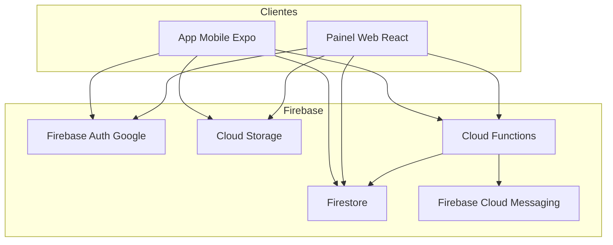
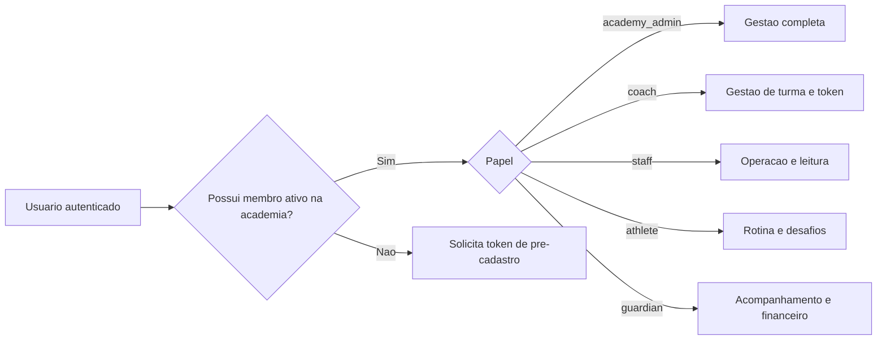
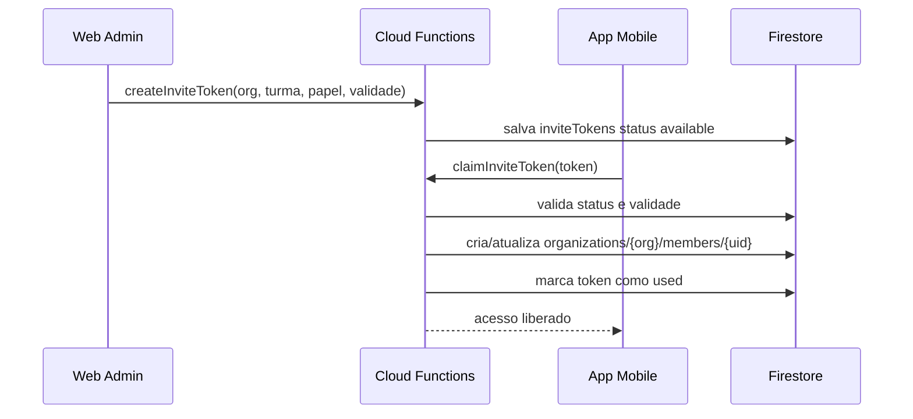

# Arquitetura Tecnica - AtleticX

## Visao geral

## Modelo de acesso

## Fluxo de pre-cadastro com token

## Colecoes principais

- `users/{uid}`
- `organizations/{orgId}`
- `organizations/{orgId}/members/{uid}`
- `classes/{classId}`
- `inviteTokens/{tokenId}`
- `auditLogs/{logId}`

## Regras de seguranca aplicadas

- leitura e escrita por autenticacao obrigatoria;
- leitura de academia apenas para membro ativo;
- criacao de token apenas para gestor de academia;
- ativacao de token via funcao server-side;
- trilha de auditoria para eventos sensiveis.

## Multiacademia

Um mesmo usuario pode ter:

- memberships em varias academias;
- papeis diferentes por academia;
- turmas diferentes por academia.

A troca de contexto ocorre pelo `organizationId` selecionado no painel e pelos vinculos ativos no app.
