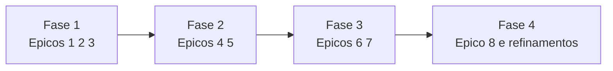

# Backlog MVP

## Epico 1 - Identidade e acesso

- Como aluno, quero entrar com Google para acessar rapido.
- Como responsavel, quero vincular minha conta ao aluno para acompanhar progresso.
- Como admin, quero controlar permissoes por papel.

Critérios de aceite:

- Login com Google ativo.
- Varios papeis por usuario quando permitido.
- Regras de acesso por perfil no app e web.

## Epico 2 - Estrutura da academia

- Como admin, quero cadastrar academia, turmas e modalidades.
- Como professor, quero gerenciar alunos por turma.
- Como staff, quero visualizar status geral da turma.

Critérios de aceite:

- Cadastro completo de turma com horario e categoria.
- Vinculo aluno-turma e professor-turma.
- Filtros por faixa, idade e nivel.

## Epico 3 - Desafios e evidencias

- Como professor, quero criar desafio com prazo e regra de envio.
- Como aluno, quero enviar foto ou video como comprovacao.
- Como professor, quero aprovar ou reprovar evidencia com feedback.

Critérios de aceite:

- Desafio com data de inicio, fim e pontuacao.
- Upload de imagem/video com validacao.
- Registro de parecer do professor.

## Epico 4 - Conteudo e trilhas

- Como professor, quero subir video e material para turma.
- Como aluno, quero concluir conteudo com regra minima.
- Como professor, quero saber quem concluiu.

Critérios de aceite:

- Definicao de tempo minimo ou paginas minimas.
- Registro de consumo por aluno.
- Relatorio de conclusao por turma.

## Epico 5 - Gamificacao

- Como aluno, quero ganhar pontos e badges ao cumprir metas.
- Como professor, quero configurar regras de pontuacao.
- Como academia, quero ranking visivel por categoria.

Critérios de aceite:

- Regra de pontos por tipo de acao.
- Concessao automatica de badge.
- Ranking atualizado em periodo definido.

## Epico 6 - Graduacao e ranking esportivo

- Como professor, quero definir pesos para percentual de faixa.
- Como admin, quero homologar elegibilidade de graduacao.
- Como aluno, quero acompanhar meu percentual de evolucao.

Critérios de aceite:

- Formula de percentual configuravel.
- Historico de alteracoes de regra.
- Tela de evolucao por criterio.

## Epico 7 - Comunicacao e alertas

- Como aluno, quero receber lembretes de rotina.
- Como professor, quero alerta de evidencias pendentes.
- Como responsavel, quero aviso financeiro e academico.

Critérios de aceite:

- Push notifications segmentadas.
- Regras de frequencia para nao gerar excesso.
- Registro de entrega e abertura.

## Epico 8 - Financeiro basico

- Como responsavel, quero acompanhar mensalidades e vencimentos.
- Como admin, quero ver inadimplencia por turma.
- Como academia, quero associar status financeiro ao perfil.

Critérios de aceite:

- Cadastro de cobrancas e status.
- Painel de inadimplencia por periodo.
- Alertas de vencimento e atraso.

## Priorizacao sugerida

## Definicao de pronto

- Historia com criterio de aceite atendido.
- Regra de permissao validada.
- Evento de auditoria registrado.
- Telemetria minima em Analytics.
- Fluxo testado em app e painel web.
