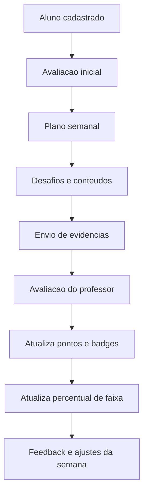
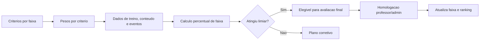
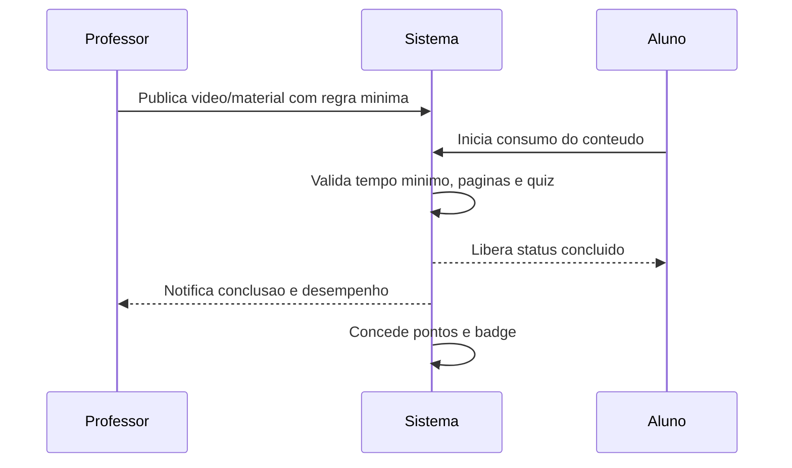
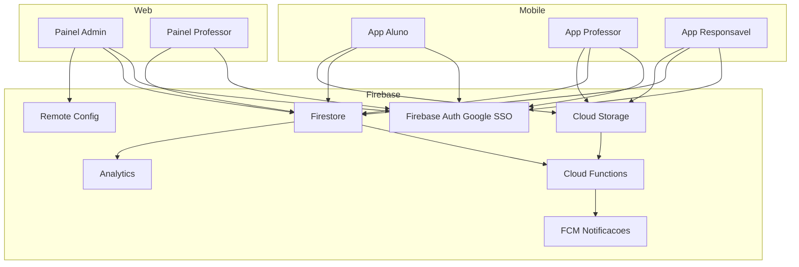
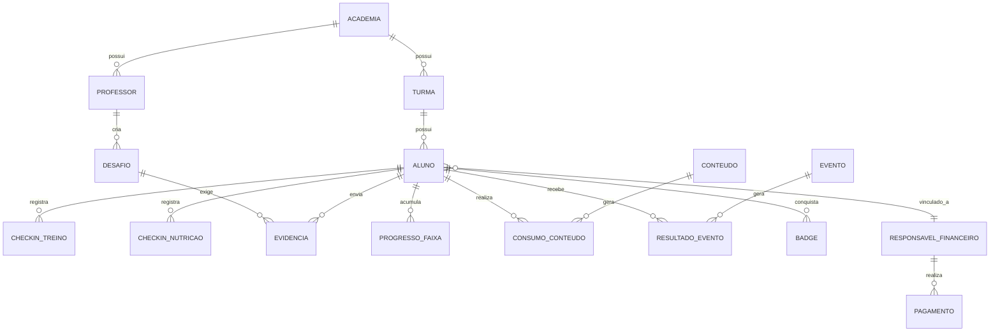
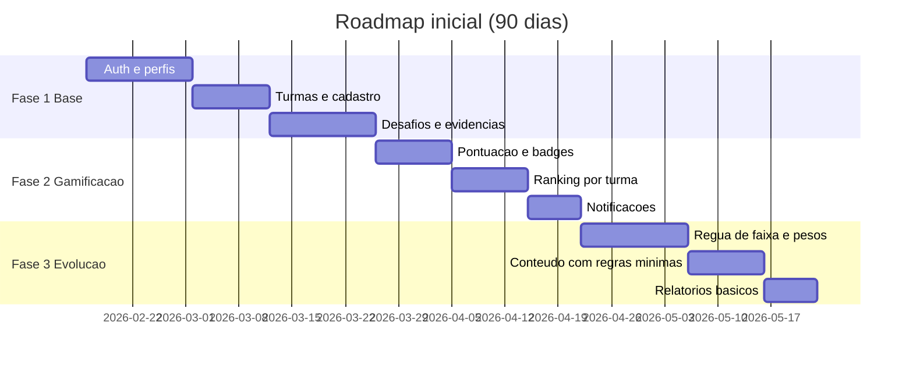

# Sistema de Gamificacao para Artes Marciais

## 0. Decisao de naming

- Nome oficial da plataforma: `AtleticX`
- Assinatura institucional: `Athlete Extreme`
- Tagline principal: `Evolua no seu maximo.`
- Documento de referencia: `decisao-marca-atleticx.md`

## 1. Objetivo do produto

Criar uma plataforma digital com app mobile e painel web para:

- aumentar engajamento e disciplina dos alunos;
- apoiar evolucao tecnica, fisica e comportamental;
- dar rastreabilidade para graduacao e ranking;
- permitir acompanhamento por professores, staff e responsaveis;
- transformar dados esportivos em gestao clara para academia e dojo.

## 2. Perfis e permissoes

- `Super Admin`: padroes globais, templates oficiais, regras multiacademia.
- `Admin da Academia`: unidade, turmas, professores, configuracoes e planos.
- `Professor/Coach`: desafios, avaliacoes, pontuacoes, conteudos e feedback.
- `Staff`: operacao diaria, suporte e comunicacoes.
- `Aluno/Atleta`: execucao de trilhas, envio de evidencias e progresso.
- `Responsavel Financeiro`: acompanhamento de evolucao, pagamentos e alertas.

## 3. Dominios de negocio

### 3.1 Identidade e acesso

- Google SSO para entrada rapida.
- Vinculo aluno-responsavel financeiro.
- Controle de perfil e escopo de acesso por papel.
- Consentimentos para uso de dados e midia.

### 3.2 Academia e estrutura esportiva

- Unidades, turmas, modalidades e categorias.
- Regras por faixa, idade, peso e nivel.
- Calendario de treinos e eventos.

### 3.3 Treino e performance

- Plano de treino por fase esportiva.
- Metas de condicionamento, agilidade e elasticidade.
- Check-ins diarios e avaliacao periodica.
- Painel de evolucao individual e da turma.

### 3.4 Nutricao e rotina

- Diario alimentar e hidratacao.
- Rotina de sono e recuperacao.
- Evidencias em foto/video para validacao.

### 3.5 Conteudo e aprendizado

- Biblioteca de aulas, materiais e videos.
- Regras de conclusao por tempo minimo, paginas minimas e quiz.
- Controle de consumo e taxa de conclusao.

### 3.6 Gamificacao

- Missoes e desafios por objetivo.
- Pontos, badges, streaks e niveis.
- Bonus de constancia e reducao de fraude.

### 3.7 Graduacao e ranking

- Regua de criterios com pesos por faixa.
- Pontuacao por eventos e competicoes.
- Ranking por categoria para comparacao justa.

### 3.8 Financeiro

- Mensalidade e status de pagamento.
- Politicas de bolsa, desconto e inadimplencia.
- Visao do responsavel com historico.

### 3.9 Comunicacao e alertas

- Notificacoes push e lembretes.
- Alertas de atraso, pendencias e metas.
- Comunicados segmentados por turma.

### 3.10 Auditoria e compliance

- Trilha de auditoria para pontuacao e avaliacao.
- Polticas LGPD, retencao e exclusao de dados.
- Regras de moderacao de conteudo.

## 4. Fluxos de negocio principais

### 4.1 Jornada do aluno no ciclo semanal

### 4.2 Fluxo de graduacao e elegibilidade de faixa

### 4.3 Fluxo de conteudo com regra minima

## 5. Modelo de pontuacao e progresso

## 5.1 Exemplo de pesos para percentual de faixa

- Tecnica: 40%
- Condicionamento fisico: 20%
- Frequencia e disciplina: 20%
- Conteudo e teoria: 10%
- Conduta e valores: 10%

## 5.2 Regras recomendadas

- Ranking separado por categoria.
- Pontuacao com teto por periodo para evitar distorcao.
- Evidencia obrigatoria em desafios criticos.
- Janela de revisao do professor com SLA definido.

## 6. Arquitetura proposta (Google SSO + Firebase)

## 7. Modelo de dados conceitual

## 8. Politicas e seguranca

- Regras de acesso por papel no app e no painel.
- Dados de menores com consentimento formal.
- Criptografia em transito e em repouso.
- Logs de auditoria em alteracoes de nota/pontuacao.
- Politica de retencao para fotos e videos.

## 9. Notificacoes e alertas essenciais

- Lembrete de check-in de treino e alimentacao.
- Alerta de desafio perto do vencimento.
- Aviso de pendencia de avaliacao do professor.
- Notificacao de badge conquistado.
- Alerta de inadimplencia para responsavel.
- Alerta de sobrecarga quando houver excesso de treino.

## 10. Monetizacao

- `SaaS por academia`: preco por unidade e por faixa de alunos ativos.
- `Planos Start/Pro/Enterprise`: recursos e limites progressivos.
- `Add-ons`: armazenamento extra, BI, automacoes de comunicacao.
- `White-label`: customizacao de marca para redes maiores.
- `Taxa de transacao`: em pagamentos e inscricoes de evento.
- `Licenciamento confederativo`: padroes oficiais de pontuacao e ranking.

## 11. Indicadores de sucesso

- Retencao mensal de alunos por academia.
- Frequencia de check-ins por semana.
- Taxa de conclusao de desafios.
- Tempo medio de avaliacao do professor.
- Percentual de alunos com progresso de faixa no prazo.
- Engajamento de responsaveis financeiros.

## 12. Roadmap sugerido

## 13. Riscos e mitigacoes

- Fraude de evidencias: usar metadados, janela de revisao e trilha de auditoria.
- Perda de engajamento: ciclos curtos de desafio e recompensas de constancia.
- Sobrecarga do professor: automacoes e fila priorizada por SLA.
- Injustica no ranking: segmentacao por categoria e pesos transparentes.
- Complexidade excessiva no inicio: escopo de MVP com iteracoes quinzenais.
